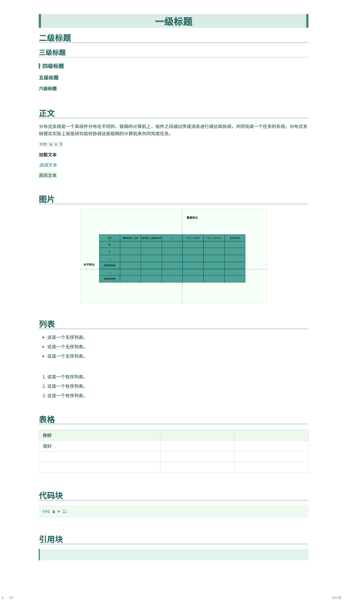
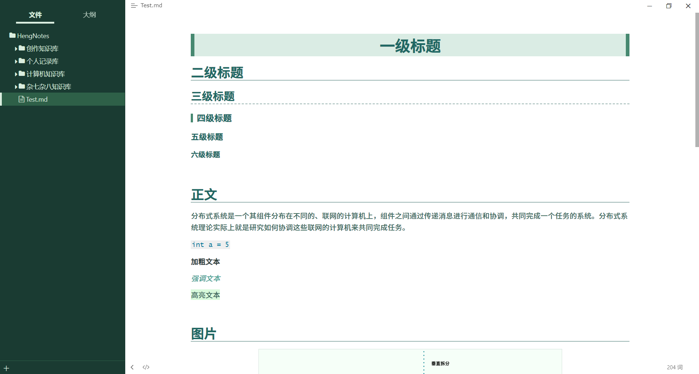
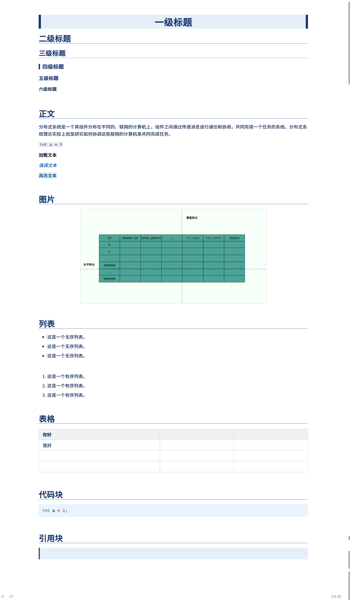
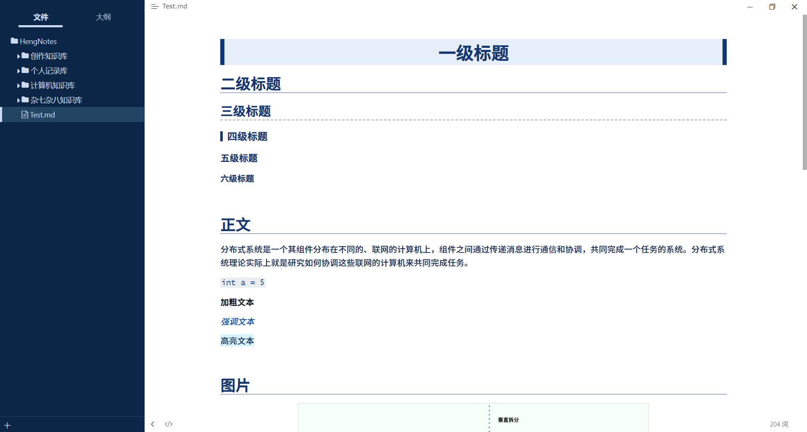
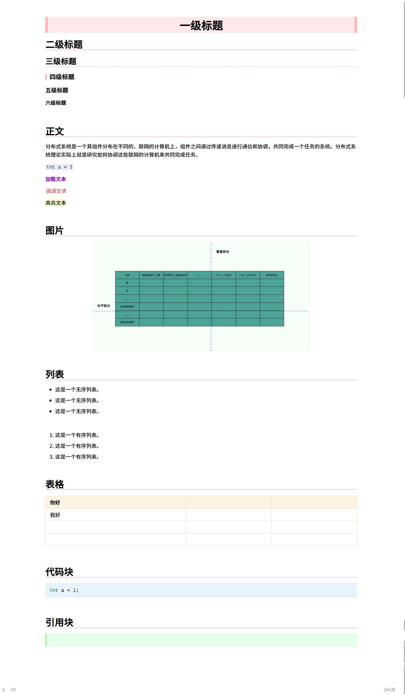
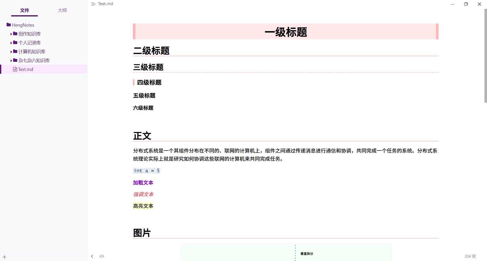

# Dog's Choice

## Dog's Choice 是什么

Dog's Choice 是一款 Typora 主题。Dog's Choice，狗子的选择，狗子遍观各类主题，广泛借鉴，最终编写出自己最中意的主题风格。如果有人和狗子一样喜欢它，狗子将倍感荣幸。

如果你觉得某些地方不合心意，欢迎提出，狗子将认真思考你的建议。

狗子后续会不断更新主题配色方案，敬请期待。

## 安装

- 下载主题资源包。
- 打开Typora菜单，选择**主题** > **打开主题文件夹**，将下载的css样式文件与资源文件夹复制到主题文件夹中。
- 重启Typora，打开Typora菜单，选择**主题**，然后选择Dog's Choice相应主题即可。

## 主题预览

### 远山绿配色

### 极地蓝配色

### 七彩虹配色

